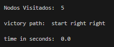

# Report

Este documento contém algumas informações sobre a minha implementação do algoritmo de busca ‘*A-Star*’ para o primeiro trabalho da disciplina ‘Sistemas Inteligentes’.

## The Algorithm

**Tópico 1.**

Primeiramente vou discorrer sobre as três bibliotecas do python que utilizei:

- ***time*** é uma biblioteca para armazenar o tempo para comparações entre os algoritmos;
- ***copy*** é uma biblioteca usada como solução para o problema que tive com os ponteiros do python se sobrescrevendo ao criar múltiplos arrays e objetos;
- **heapq** é uma biblioteca que importa uma heap pronta do python para uso.

### Variables

As variáveis usadas podem variar dependendo da variação do meu algoritmo. Porém, muitas delas são comuns as três versões do algoritmo:

- ‘***already_visited’*** representa a lista de nodos já visitados e é composta por estados que já foram descobertos;
- ‘***movements’*** representa uma lista com os possíveis movimentos que o nodo atual pode tomar. Ela é atualizada/reescrita à cada ‘run’ do algoritmo e é intimamente relacionada com ‘***moves***’;
- ‘***moves’*** representa uma lista de tuplas, dentro dessa tupla está o movimento possível (no caso do jogo 8-puzzle apenas 4 combinações são aceitas: 'up_move’, 'down_move’, 'right_move’ e 'left_move’)) e o seu relacionador matemático, em outra tupla;
- ‘***move_functions***' representa um dicionário que, a partir do primeiro elemento das tuplas de ‘***moves***’, é chamada a função específica para realizar o movimento;

Agora, as variáveis que variam (hahaha) entre os algoritmos:

- ‘***initial_state***’ representa o estado inicial, o input, como o jogo começará. Varia entre uma versão do algoritmo e outra:
    - No caso **sem** heurística, é representado por um dict com o estado e o path dentro;
    - No caso **com** heurística, é representado por um objeto ‘nodo’, contendo o estado, o custo e o path;
- ‘***queue***’ representa a queue usada para o custo uniforme. Varia entre uma versão do algoritmo e outra:
    - No caso **sem** heurística, é representado por um array (com o comportamento de append e pop, vulgo custo uniforme);
    - No caso **com** heurística, é representado por uma heap para ordenar baseado no custo do state;

### Functions

Indo para a parte das funções fora do algoritmo principal, mas que são chamadas incontáveis vezes ao longo da execução:

- ‘***find_blank_tile***’ recebe um state qualquer e, através de belos ‘O(N²)’ for’s, identifica o tile ‘0’ - minha representação do espaço em branco. Além disso, com o ‘0’ identificado, já é chamada a função ‘***possible_movements***’ para traçar os movimentos possíveis;
- ‘***possible_movements***’ chamada a partir da anterior e usando a variável ‘***moves***’, traça os movimentos possíveis para aquele state passado para ‘***find_blank_tile***’ e os adiciona na variável ‘***movements’**.*
- ‘***count_movements***’ é chamada ao final para printar o número de jogadas realizadas, o método só precisa dividir a string em pedaços e tirar o **len**().

Além dessas, também conto externamente com as funções de movimento: 

- '***up_move***’, '***down_move***’, '***right_move***’ e '***left_move***’. Cada uma delas tem o mesmo comportamento:
    - Faz uma cópia virtual do array (**sem** heurística) ou do objeto nodo (**com** heurística), altera os valores baseado no movimento selecionado, atualiza a string do path utilizado para identificar a solução e retorna o novo array/objeto.

### Classes

O coração do algoritmo com heurística está nessa seção. Para realizar a busca heurística, ao invés de apenas dicionários, foram criados objetos pela classe ‘***Node***’ e eles foram armazenados na heap ‘***PriorityQueue***’. 

Criei as classes por preferir categorizar cada método ao invés de simplesmente chamar do python. Utilizei a inteligência artificial da google, **bard**, para criar as classes (por comodismo).

Caso o professor queira conferir meu prompt, acesse esse link: [https://g.co/bard/share/78acb73e64c6](https://g.co/bard/share/78acb73e64c6)

## Main Function

A função principal do A-Star, resumidamente conta com esses passos:

1. Add o estado inicial na queue e na lista de estados já visitados
2. ‘*while*’ que só acaba quando não há mais nenhum nodo na queue a ser explorado (o algoritmo, com toda a certeza, vai terminar antes disso acontecer). **A partir de cada loop desse ‘*while*’:**
    1. Remove os movimentos do ‘while’ passado, puxa o próximo item da queue (se for com heurística, será o menor custo);
    2. ‘*If*’ para testar vitórias. dentro dele há vários prints com os dados solicitados pelo professor.
    3. find_blank_tile é chamado, retornando o a linha e coluna do espaço em branco (por de baixo dos panos também já traça os movimentos que usarem no futuro);
    4. ‘*for*’ entre os movimentos possíveis para o blank tile.
        1. A cada iteração, um novo state é achado com as funções de movimento, testado para ver se já existe e adicionado na queue e no ‘already_visited’ caso não.

---

********************Tópico 2.********************

O controle de fronteira, como explicado acima, ocorre no manejo dos arrays da ‘queue’ e do ‘already_visited’. A cada nodo achado ele é adicionado em ‘already_visited’, o que deixa a nossa fronteira apenas para nodos ainda não explorados e que estão sendo analisados pela ‘queue’. 

A ‘queue’ em si são todas as possibilidades da fronteira que temos no momento.

## Heuristics (‘***counter_heuristic***’ & ‘***manhattan_counter_heuristic***’)

**Tópico 3.**

As heurísticas utilizadas foram a ‘***counter_heuristic***’ e a ‘***manhattan_counter_heuristic***’. 

A ‘***counter_heuristic***’ foi vista em sala e se baseia em identificar o número de elementos fora de suas posições. 

Já a ‘***manhattan_counter_heuristic***’ é uma implementação minha própria e que funde a heurística de counter vista em sala com a famosa heurística de manhattan (Essa heurística, em resumo, calcula o quão distante cada tile está do seu objetivo). 

---

‘***manhattan_counter_heuristic***’ é uma junção dessa com a **counter** e me deram os melhores resultados práticos, dentre todos os meus testes.

```python
def manhattan_counter_heuristic(state):
    goal_state = [[1, 2, 3], [4, 5, 6], [7, 8, None]]
    count = 0
    distance = 0
    for i in range(3):
        for j in range(3):
            row = (state[i][j] - 1) // 3
            col = (state[i][j] - 1) % 3
            distance += abs(row - i) + abs(col - j)

            if state[i][j] != goal_state[i][j]:
                count += 1
    # math represantion of manhattan_counter_heuristic.
    return distance + (count * 0.1)
```

Analisando minha heurística avançada, alguns pontos devem ser destacados:

- A fórmula matemática dela, seguindo os conhecimentos aprendidos em sala, torna os resultados do counter como ‘secundários’ em relação aos resultados da distance, vinda do algoritmo de manhattan.
- O fluxo de código se concentra em dois For’s O(N²) e, em cada iteração, o algoritmo tira a distância que aquele tile está do seu objetivo e, obviamente, se ele está ou não fora do lugar. Com isso, a soma de tiles fora do lugar e a sua distância até a sua meta, formam a minha heurística.

---

Exemplos de uso das minhas heurísticas:

‘***manhattan_counter_heuristic***’

**easy case: [[1, 2, 3], [4, 5, 6], [0, 7, 8]]**



**easy case: [[0, 2, 3], [1, 5, 6], [4, 7, 8]]**


**Medium case: [[2, 3, 6], [1, 5, 0], [4, 7, 8]]**


**Medium case: [[3, 6, 0], [2, 5, 8], [1, 4, 7]]**


**Hard case:** [[3, 0, 6], [2, 1, 5], [4, 7, 8]]


‘***counter_heuristic***’

**easy case: [[1, 2, 3], [4, 5, 6], [0, 7, 8]]**


**easy case: [[0, 2, 3], [1, 5, 6], [4, 7, 8]]**


**Medium case: [[2, 3, 6], [1, 5, 0], [4, 7, 8]]**


**Medium case: [[3, 6, 0], [2, 5, 8], [1, 4, 7]]**


**Hard case:** [[3, 0, 6], [2, 1, 5], [4, 7, 8]]


**Hardest case: [[8, 7, 6], [5, 4, 3], [2, 1, 0]]**


**Hardest case: [[8, 7, 6], [5, 4, 3], [2, 1, 0]]**


---

## Tabela Comparativa de Resultados

**Tópico 4.**

**Hard case: [[3, 0, 6], [2, 1, 5], [4, 7, 8]]**

| Algoritmo Utilizado | Tempo de Execução (segundos) | Nodos Visitados |
| --- | --- | --- |
| No Heuristic | 5138.03 | 310338 |
| ‘counter_heuristic’ | 0.09 | 1085 |
| ‘manhattan_counter_heuristic’ | 0.03 | 108 |

**Medium case:** **[[2, 3, 6], [1, 0, 5], [4, 7, 8]]**

| Algoritmo Utilizado | Tempo de Execução (segundos) | Nodos Visitados |
| --- | --- | --- |
| No Heuristic | 26.42 | 22447 |
| ‘counter_heuristic’ | 0.00 | 16 |
| ‘manhattan_counter_heuristic’ | 0.00 | 16 |

**Easy case: [[0, 2, 3], [1, 5, 6], [4, 7, 8]]**

| Algoritmo Utilizado | Tempo de Execução (segundos) | Nodos Visitados |
| --- | --- | --- |
| No Heuristic | 0.01 | 103 |
| ‘counter_heuristic’ | 0.00 | 8 |
| ‘manhattan_counter_heuristic’ | 0.00 | 8 |

## Problemas Encontrados

**********Tópico 5.**********

Houveram alguns problemas durante a minha implementação, como por exemplo: ponteiros do python reescrevendo variáveis, recursividade do python não suportando o número de nodos (o que me fez mudar de estratégia), entre outros. Porém, um problema que me afligiu até o final da implementação foi em relação aos path’s de vitória.

Meu algoritmo inicial, por ser uma queue fechada, retorna sempre o melhor custo. Isto é, o melhor caminho possível. Entretanto, os meus algoritmos de heurística, muitas vezes, retornavam caminhos corretos, mas não o menor custo possível. As heurísticas claramente funcionam, mas eu gostaria de ter implementado elas sempre apontando para o melhor caminho possível.